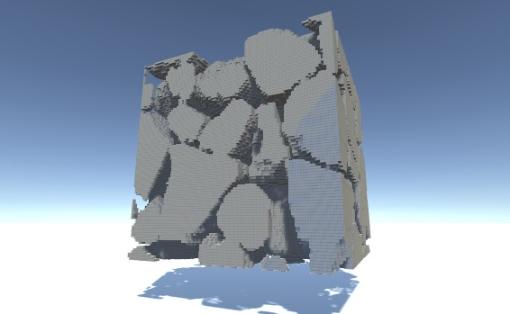
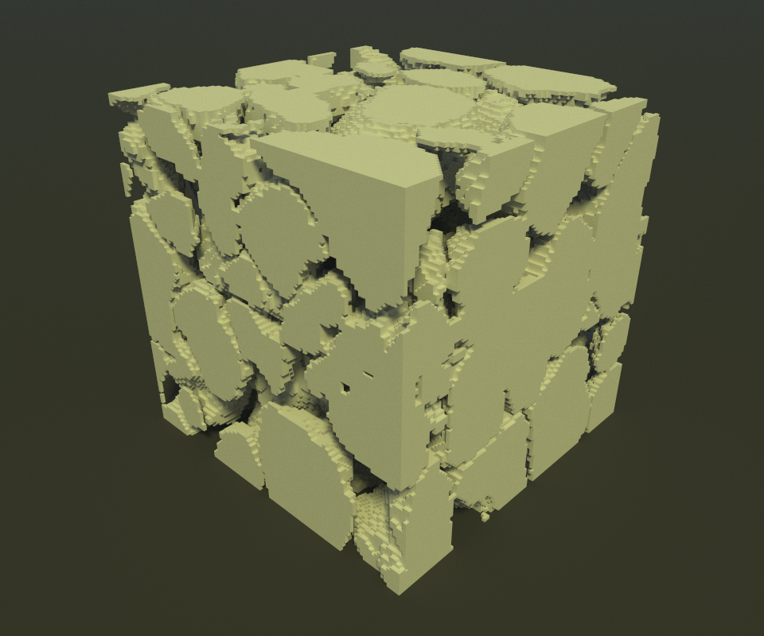

# porous-material-voxel-render

A tool to visualize voxels

## Unity

You may also the python converter and read it with the Unity renderer project

## MagicaVoxel

Creates a .vox file from .dat or .raw 3D image.

The output .vox file must be used in [MagicaVoxel](https://ephtracy.github.io/)

